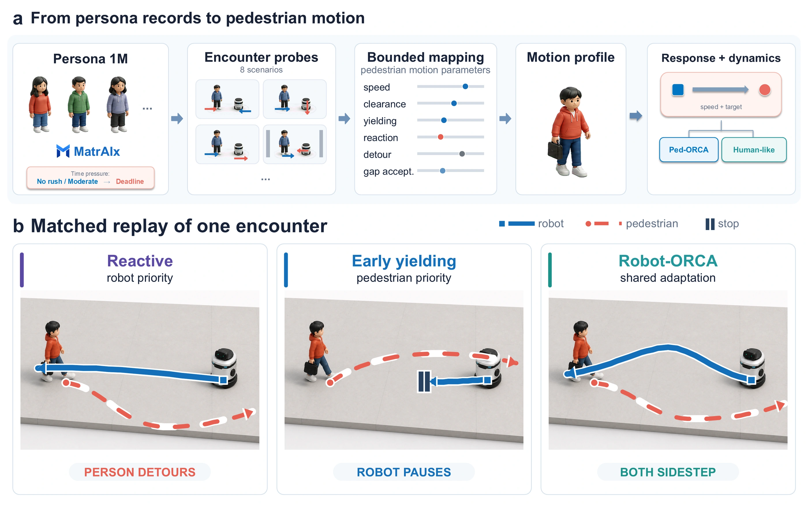

# PopNavShift

**Stress-Testing Social Navigation under Behavioral Population Shift**

Kaizhen Tan, Diyu Zheng, Tim Guangyu Wu, ChengHe Guan

[Project webpage](https://tantansir.github.io/PopNavShift/) · [Paper](https://tantansir.github.io/PopNavShift/assets/PopNavShift.pdf) · [Video](https://tantansir.github.io/PopNavShift/assets/PopNavShift_ICRA_video.mp4) · [LaTeX source ZIP](https://tantansir.github.io/PopNavShift/assets/PopNavShift_arXiv.zip)

## Overview

PopNavShift tests whether comparisons of social navigation controllers remain stable when the represented pedestrian population changes. Synthetic persona records produce structured responses to standardized robot encounter probes. A deterministic mapping converts these responses into bounded pedestrian motion profiles.

The evaluation replays identical physical episodes across eight population conditions and three controllers: reactive geometric avoidance, early yielding, and Robot-ORCA. Pedestrian added delay is measured relative to matched baselines without a robot.



## Main Finding

In the matched time-pressure intervention, controller orderings reverse more often for pedestrian burden than for robot travel time:

| Outcome | Ranking reversals |
| --- | ---: |
| Mean pedestrian delay | 22.4% |
| Worst-decile delay | 23.9% |
| Robot travel time | 8.6% |

These rates use comparable, non-tied controller orderings. Alternative mappings, pedestrian dynamics, and language models preserve the qualitative pattern, while reversal magnitudes and some controller orderings vary.

The behavioral populations are controlled synthetic inputs. The matched intervention does not estimate the causal effect of deadlines on real pedestrians.

## Materials and Code Availability

This repository hosts the project webpage, manuscript, LaTeX source package, figures, and demonstration video. The complete implementation and exact response-to-motion formulas will be released upon publication.

The source ZIP includes `root.tex`, bibliography files, the document class, and all four manuscript figures. Compile `root.tex` with pdfLaTeX after extracting the ZIP, or upload the ZIP to Overleaf.

The webpage uses plain HTML, CSS, and JavaScript and is served through GitHub Pages from the root of the `main` branch.

## Citation

```bibtex
@misc{tan2026popnavshift,
  title = {PopNavShift: Stress-Testing Social Navigation under Behavioral Population Shift},
  author = {Tan, Kaizhen and Zheng, Diyu and Wu, Tim Guangyu and Guan, ChengHe},
  year = {2026},
  url = {https://tantansir.github.io/PopNavShift/}
}
```
